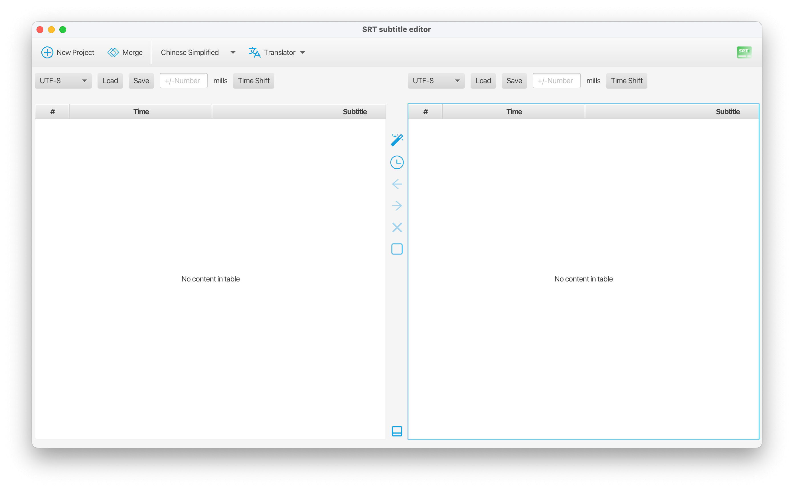

# User Guide

 

SrtEditor is a sample subtitle(srt) file editor, merger. With the SrtEditor, you can 

- [x] load two srt file side by side, 
- [x] edit the subtitle, time, 
- [x] copy selected row from one to the other, 
- [x] delete selected row, left, right or both
- [x] save the changes 
- [x] merge two srt into new one by select your selection content, e.g. 
select time from left, subtitle from right or combine both subtitles to make two language srt file
- [x] auto normalize and clean empty line.
- [x] auto calculate time base on first(or selected) line.

But the following you can not do 

- [ ] add row 

#### My Story
Before introduce the SrtEditor, I'd like to tell a story about why I create SrtEditor.

Once I have a movie copy, it a nice movie, but in English and no subtitle. I have
played it use SPlayer, it's a power movie player, witch can automatically download subtitle 
when it found no subtitle present. cool ha. This time it does download a subtitle with duo lang,
 Chinese and English, but the timeline is mess, not sync with the voice. So I have an idea, I go to 
the internet download several English subtitle and found one match the voice very perfectly.
Now what I want to do is take the time from the perfect match one and replace the time in the duo lang
ones.

So I create the SrtEditor tool to do the job for me.

### Main screen


### Load file
SrtEditor try to load the file by guess it charset. Sometime the guess will fail, 
it will open the file as iso-8859-1, or even worse fail open file. If this happened, 
just choose the correct charset, and the file will open correctly.

### Auto normalize
Auto normalize and clean the empty line in each side. Just click `Auto normlize` button.

### Adjust time
When time not match in both side. you can click `calculate shift time` button to auto calculate times: 
- base on first line's time on both side
- base on select line's time on either side
After calculation, you only need click ONE side's `Time Shift` button. This will adjust selected side's all times.

### Edit subtitle, time
The subtitle, time are editable, but the # (serial number) is not allow to edit. 
The serial number here is used for order purpose, the table will order only 
by the serial number ascending, not by the time. Just click a cell and edit, no any 
validation is done here, so be careful, don't break the timeline.

### Copy, delete selected row
The copy is only support copy one row a time, and the insert point in the target side
 is limit to before or after selected row's serial number. e.g.

 the selected row on the right is the movie name in chinese, which is missed on the left side.
 You can fix it by copy it to the left, in the example above, need insert it before the 2.0.
 The purpose of copy action is to make the rows on both side match each other. 
 And the most important thing after copy is to adjust the time, which may be a trick work.
 
 | # | time | subtitle |&nbsp;| # | time | subtitle |
 | --- | --- | --- | --- |---| --- | --- |
 | 1.0 | ... --> a | xxxxx |&nbsp;| 1.0 | ... --> a1 | xxxxxx |
 | 2.0 | b --> c | xxxxx |&nbsp;| 2.0 | b1 --> c1 | xxxxxx |
 | 3.0 | ... --> ... | xxxxx |&nbsp;| 3.0 | ... --> ... | xxxxxx |
 
    b = a + (b1 - a1)
    c = b + (c1 - b1)

The other way to fix the issue is delete it from right side. I prefer copy it to the left.

Either copy or delete will auto adjust the serial number, keep its order.

### Save changes
I don't want to overwrite the original file, so I save it to a new file. The new file name is
auto generate for you. you can pick new one.

### Merge 
The merge is most complicated one. First, both side must have same size, same number of rows. 
If not match the request, you need copy the missed, or delete some no need one. make it match.
Second, you need choose merge strategy. 

For my case, I choose the time from left side (English), subtitle from right side (duo lang, English and Chinese)
the charset I choose other, GB18030. Next step, choose file name to save.

Other use case is create duo lang subtitle, suppose you have two subtitles file with 
different language, and match the size, you can easily create a duo lang subtitle by choose combine subtitle strategy.

### Translate

Before you can use translate function, you need config the API information.
The translation engine is Microsoft Azure translation service.
set the following environment variable:
```shell
# endpoint url: https://api.cognitive.microsofttranslator.com
export BING_TRANSLATOR_KEY=<your key string>
export BING_TRANSLATOR_REGION=<your region>
```

To view api error log, you can open log window at the bottom. Some time the api will block by server, just wait for while
it will retry. you don't need to do anything.